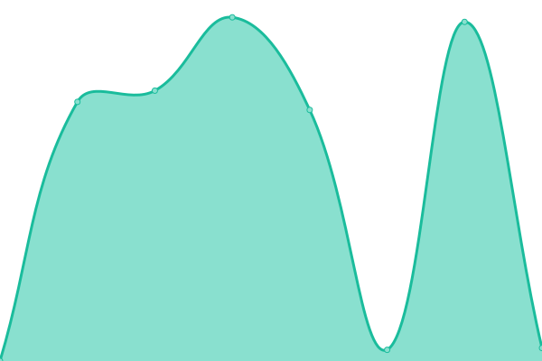

# [📈 Live Status](https://status.styleseek.se): <!--live status--> **🟧 Partial outage**

This repository contains the open-source uptime monitor and status page for [Johan Bååth](https://johanbaath.com/), powered by [Upptime](https://github.com/upptime/upptime).

With [Upptime](https://upptime.js.org), you can get your own unlimited and free uptime monitor and status page, powered entirely by a GitHub repository. We use [Issues](https://github.com/johanbaath/styleseek-uptime/issues) as incident reports, [Actions](https://github.com/johanbaath/styleseek-uptime/actions) as uptime monitors, and [Pages](https://status.styleseek.se) for the status page.

<!--start: status pages-->
<!-- This summary is generated by Upptime (https://github.com/upptime/upptime) -->
<!-- Do not edit this manually, your changes will be overwritten -->
<!-- prettier-ignore -->
| URL | Status | History | Response Time | Uptime |
| --- | ------ | ------- | ------------- | ------ |
|  [StyleSeek](https://styleseek.se) | 🟩 Up | [style-seek.yml](https://github.com/johanbaath/styleseek-uptime/commits/master/history/style-seek.yml) | 

 2880ms
     
 | 

<a href="https://status.styleseek.se/history/style-seek">100.00%</a>
    

|  [StyleSeek Global CDN](https://styleseekcdn.se) | 🟥 Down | [style-seek-global-cdn.yml](https://github.com/johanbaath/styleseek-uptime/commits/master/history/style-seek-global-cdn.yml) | 

 221ms
     
 | 

<a href="https://status.styleseek.se/history/style-seek-global-cdn">20.73%</a>
    

<!--end: status pages-->

[**Visit our status website →**](https://status.styleseek.se)

## 📄 License

- Powered by: [Upptime](https://github.com/upptime/upptime)
- Code: [MIT](./LICENSE) © [Johan Bååth](https://johanbaath.com/)
- Data in the `./history` directory: [Open Database License](https://opendatacommons.org/licenses/odbl/1-0/)
